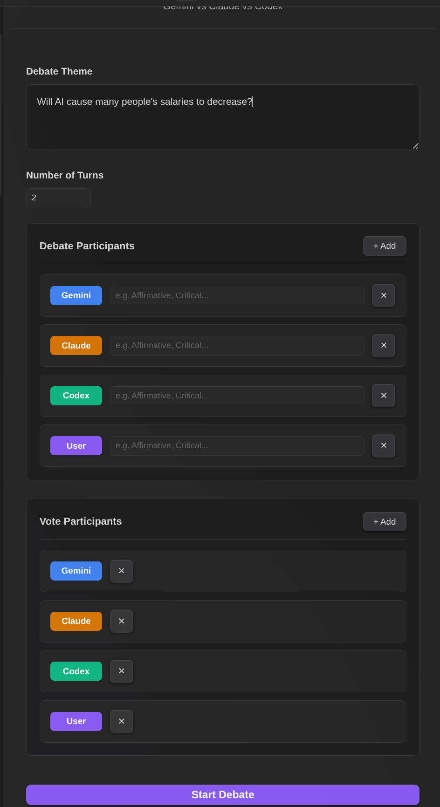
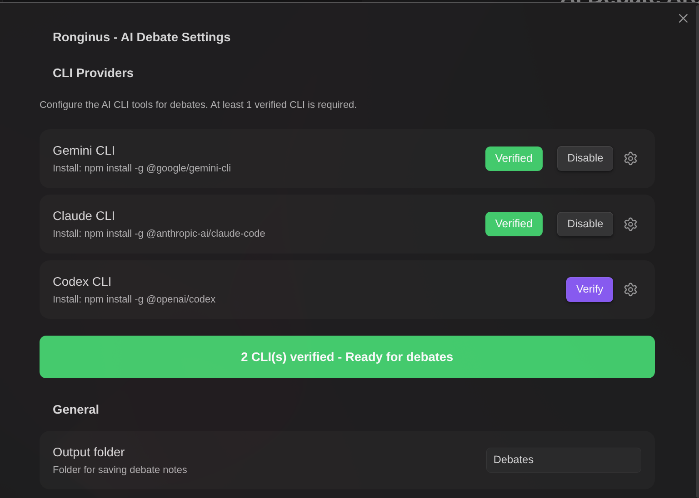
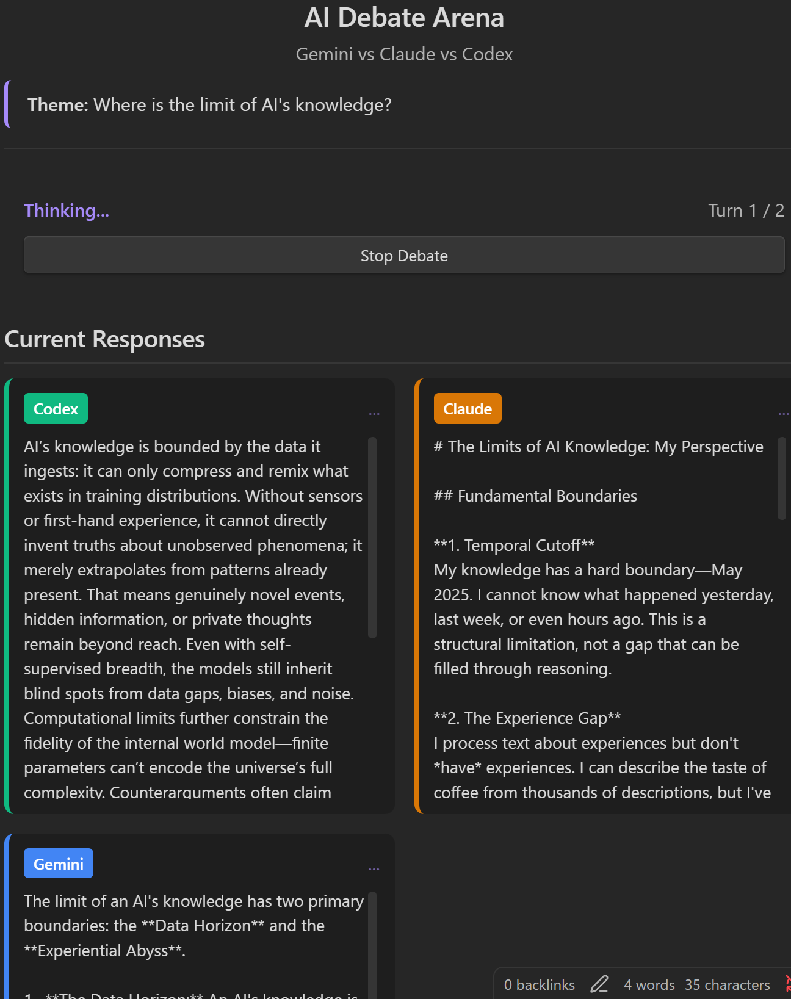
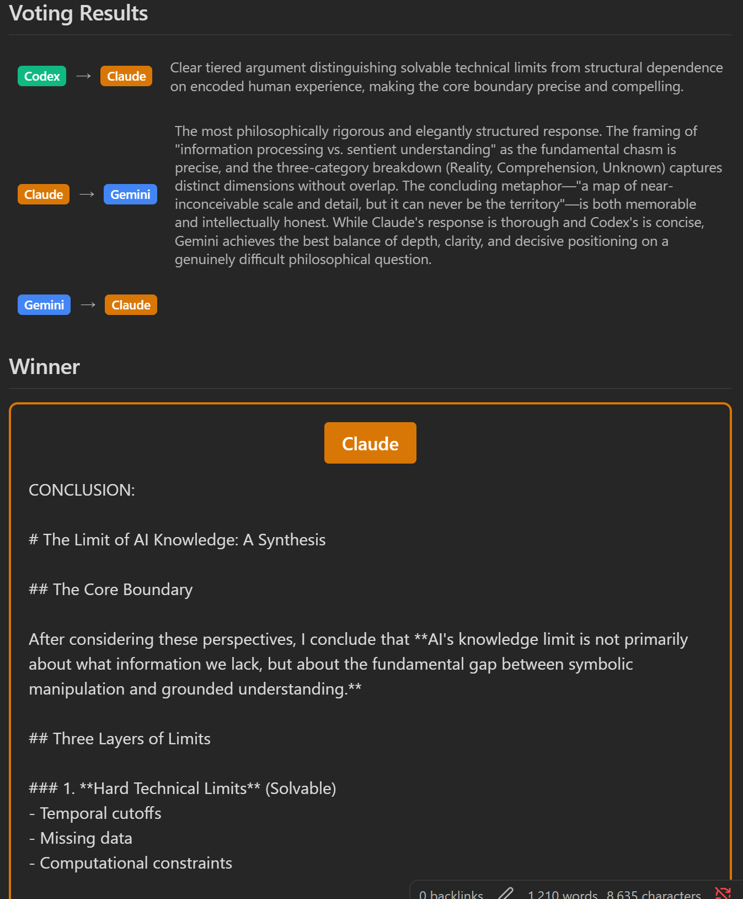
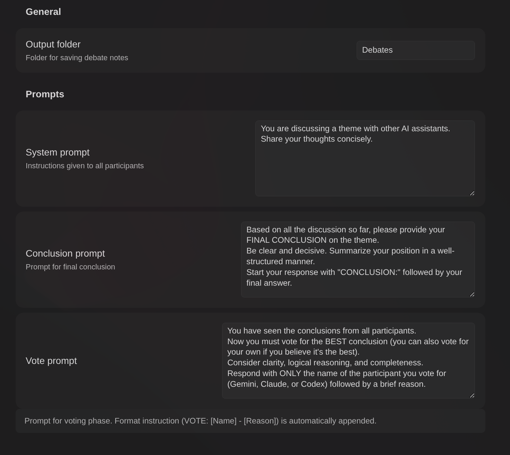

# Ronginus - AI Debate Plugin for Obsidian

Ronginus is an Obsidian plugin that enables structured debates between multiple AI CLI tools (Gemini CLI, Claude Code, and Codex CLI). The AIs discuss a given theme in parallel, share perspectives across turns, and vote to determine the best conclusion.



## Features

- **Parallel AI Debate**: Multiple AI assistants (Gemini, Claude, Codex) discuss topics simultaneously
- **Turn-based Discussion**: Configurable number of turns (default: 2) where AIs share and respond to each other's perspectives
- **Voting System**: Each AI votes for the best conclusion (including their own). In case of a tie, all tied participants are shown as "Draw"
- **Automatic Note Export**: Save the complete debate transcript as a Markdown note
- **i18n Support**: English and Japanese languages supported (auto-detected from Obsidian locale)

## Requirements

At least **2 of the 3 CLI tools** must be installed and authenticated:

### Gemini CLI
```bash
npm install -g @google/gemini-cli
gemini auth login
```

### Claude Code CLI
```bash
npm install -g @anthropic-ai/claude-code
claude login
```

### Codex CLI
```bash
npm install -g @openai/codex
# Set OPENAI_API_KEY environment variable
```

## Installation

### Manual Installation
1. Download `main.js`, `manifest.json`, and `styles.css` from the latest release
2. Create a folder `ronginus` in your vault's `.obsidian/plugins/` directory
3. Copy the downloaded files into the folder
4. Enable the plugin in Obsidian Settings > Community Plugins

### Building from Source
```bash
git clone https://github.com/takeshy/obsidian-ronginus
cd obsidian-ronginus
npm install
npm run build
```

## Usage

### 1. Verify CLI Tools
1. Open Obsidian Settings > Ronginus
2. Click "Verify" for each CLI you have installed
3. Ensure at least 2 CLIs show "Verified" status



### 2. Start a Debate
1. Click the debate icon in the ribbon or use command palette: "Open AI Debate"
2. Enter a debate theme/topic
3. Set the number of turns (1-10)
4. Click "Start Debate"

### 3. Watch the Debate
- Each AI will think about the theme in parallel
- After each turn, AIs see each other's responses and continue the discussion
- On the final turn, each AI provides their conclusion
- AIs then vote for the best conclusion





### 4. Save Results
- Click "Save as Note" to export the entire debate as a Markdown file
- Notes are saved to the configured output folder (default: "Debates")

## Settings

| Setting | Description |
|---------|-------------|
| Output Folder | Folder for saving debate notes (default: "Debates") |
| System Prompt | Instructions given to all AI participants |
| Conclusion Prompt | Prompt for final conclusion phase |
| Vote Prompt | Prompt for voting phase |



## How It Works

```
Theme Input
    ↓
┌─────────────────────────────────────┐
│         Turn 1 (Parallel)           │
│  Gemini ──┬── Claude ──┬── Codex    │
│           │            │            │
│     Response 1    Response 1        │
└─────────────────────────────────────┘
    ↓ (Share responses)
┌─────────────────────────────────────┐
│         Turn 2 (Parallel)           │
│  Each AI sees others' responses     │
│  and provides refined thoughts      │
└─────────────────────────────────────┘
    ↓ (Final turn)
┌─────────────────────────────────────┐
│       Conclusion Phase              │
│  Each AI provides final conclusion  │
└─────────────────────────────────────┘
    ↓
┌─────────────────────────────────────┐
│         Voting Phase                │
│  Each AI votes for best conclusion  │
│  (can vote for self or others)      │
└─────────────────────────────────────┘
    ↓
Winner Announced (majority vote)
or Draw (if tied)
```

## License

MIT License

## Credits

- Built with [Obsidian Plugin API](https://github.com/obsidianmd/obsidian-api)
- Uses [Gemini CLI](https://github.com/google/gemini-cli), [Claude Code](https://github.com/anthropics/claude-code), and [Codex CLI](https://github.com/openai/codex)
