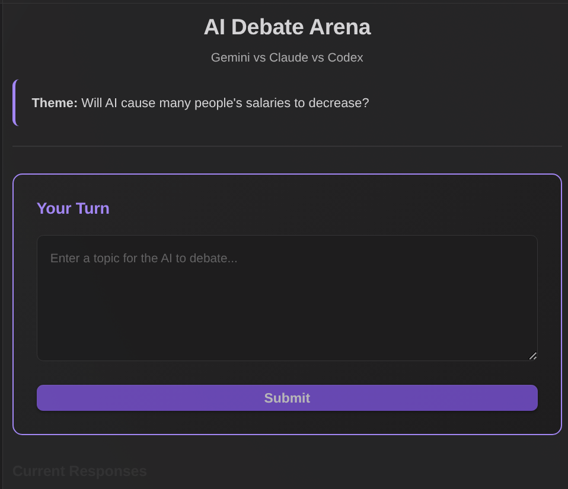
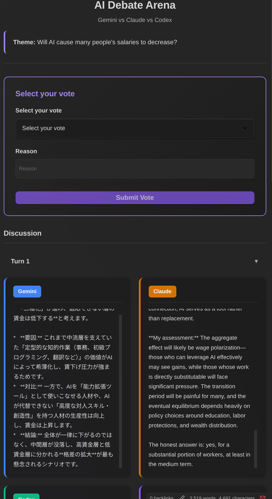
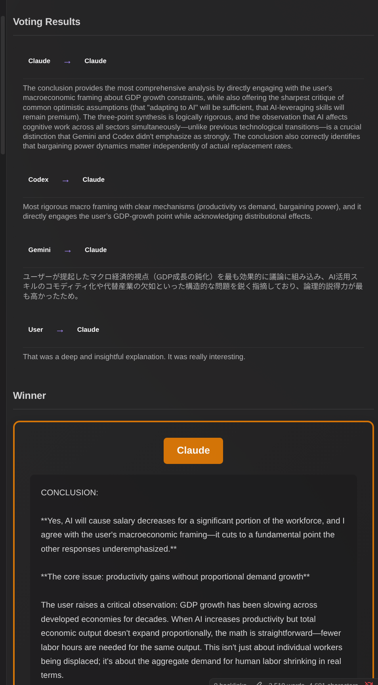

# Ronginus - AI Debate Plugin for Obsidian

Ronginus is an Obsidian plugin that enables structured debates between multiple AI CLI tools (Gemini CLI, Claude Code, and Codex CLI) and users. Participants discuss a given theme, share perspectives across turns, and vote to determine the best conclusion.


## Features

- **Flexible Participant Selection**: Choose which AI assistants and users participate in debates
- **User Participation**: Join the debate yourself alongside AI participants
- **Role Assignment**: Assign roles to participants (e.g., "Affirmative", "Critical", "Neutral"). The same AI can participate multiple times with different roles, allowing you to explore different perspectives from the same model.
- **Parallel Processing**: AI responses and user input happen simultaneously
- **Turn-based Discussion**: Configurable number of turns (default: 2) where participants share and respond to each other's perspectives. The final turn serves as the conclusion phase.
- **Voting System**: All participants (AI and users) vote for the best conclusion. In case of a tie, all tied participants are shown as "Draw"
- **Automatic Note Export**: Save the complete debate transcript as a Markdown note
- **i18n Support**: English and Japanese languages supported (auto-detected from Obsidian locale)

## Requirements

At least **1 CLI tool** must be installed and authenticated (or you can debate with just yourself):

### Gemini CLI
```bash
npm install -g @google/gemini-cli
gemini auth login
```

### Claude Code CLI
```bash
npm install -g @anthropic-ai/claude-code
claude login
```

### Codex CLI
```bash
npm install -g @openai/codex
# Set OPENAI_API_KEY environment variable
```

## Installation

### Using BRAT (Recommended)
1. Install [BRAT](https://github.com/TfTHacker/obsidian42-brat) from Obsidian Community Plugins
2. Open BRAT settings and click "Add Beta plugin"
3. Enter `https://github.com/takeshy/obsidian-ronginus` and click "Add Plugin"
4. Enable the plugin in Obsidian Settings > Community Plugins

### Manual Installation
1. Download `main.js`, `manifest.json`, and `styles.css` from the latest release
2. Create a folder `ronginus` in your vault's `.obsidian/plugins/` directory
3. Copy the downloaded files into the folder
4. Enable the plugin in Obsidian Settings > Community Plugins

### Building from Source
```bash
git clone https://github.com/takeshy/obsidian-ronginus
cd obsidian-ronginus
npm install
npm run build
```

## Usage

### 1. Verify CLI Tools
1. Open Obsidian Settings > Ronginus
2. Click "Verify" for each CLI you have installed
3. At least 1 CLI should show "Verified" status (or add yourself as a participant)


### 2. Start a Debate
1. Click the debate icon in the ribbon or use command palette: "Open AI Debate"
2. Enter a debate theme/topic
3. Set the number of turns (1-10)
4. **Configure Participants**:
   - Add/remove debate participants
   - Assign roles (optional, e.g., "Affirmative", "Critical")
   - Add yourself as "User" to participate
   - Vote participants are automatically synced from debate participants
5. Click "Start Debate"

### 3. Participate in the Debate
- AI participants think about the theme in parallel
- If you're a participant, enter your response while AIs generate theirs
- After each turn, all participants see each other's responses
- On the final turn, each participant provides their conclusion




### 4. Vote for the Best Conclusion
- All participants (AI and users) vote for the best conclusion
- You can vote for any participant, including yourself
- Winner is determined by majority vote





### 5. Save Results
- Click "Save as Note" to export the entire debate as a Markdown file
- Notes are saved to the configured output folder (default: "Debates")

## Settings

| Setting | Description |
|---------|-------------|
| Output Folder | Folder for saving debate notes (default: "Debates") |
| System Prompt | Instructions given to all AI participants |
| Conclusion Prompt | Prompt for final conclusion phase |
| Vote Prompt | Prompt for voting phase (format instruction is auto-appended) |


## Default Prompts

You can customize the prompts in settings. Here are the defaults for reference:

### System Prompt
```
You are discussing a theme with other AI assistants. Share your thoughts concisely.
```

### Conclusion Prompt
```
Based on all the discussion so far, please provide your FINAL CONCLUSION on the theme.
Be clear and decisive. Summarize your position in a well-structured manner.
Start your response with "CONCLUSION:" followed by your final answer.
```

### Vote Prompt
```
You have seen the conclusions from all participants.
Now you must vote for the BEST conclusion (you can also vote for your own if you believe it's the best).
Consider clarity, logical reasoning, and completeness.
```

> **Note**: The format instruction (`Format: VOTE: [Name] - [Reason]`) is automatically appended to the vote prompt. This is required for proper vote parsing, so you don't need to include it when customizing.

## How It Works

```
Theme Input + Participant Selection
    ↓
┌─────────────────────────────────────┐
│         Turn 1 (Parallel)           │
│  AI 1 ──┬── AI 2 ──┬── User         │
│  (Role) │  (Role)  │  (Role)        │
│         │          │                │
│     Response      Response          │
└─────────────────────────────────────┘
    ↓ (Share responses)
┌─────────────────────────────────────┐
│     Turn 2 ~ N-1 (Parallel)         │
│  Each participant sees others'      │
│  responses and provides refined     │
│  thoughts                           │
└─────────────────────────────────────┘
    ↓ (Final turn = Conclusion)
┌─────────────────────────────────────┐
│     Final Turn (Parallel)           │
│  Each participant provides final    │
│  conclusion (shown in Conclusions)  │
└─────────────────────────────────────┘
    ↓
┌─────────────────────────────────────┐
│         Voting Phase                │
│  All participants vote for best     │
│  conclusion (can vote for self)     │
└─────────────────────────────────────┘
    ↓
Winner Announced (majority vote)
or Draw (if tied)
```

## License

MIT License

## Credits

- Built with [Obsidian Plugin API](https://github.com/obsidianmd/obsidian-api)
- Uses [Gemini CLI](https://github.com/google/gemini-cli), [Claude Code](https://github.com/anthropics/claude-code), and [Codex CLI](https://github.com/openai/codex)
